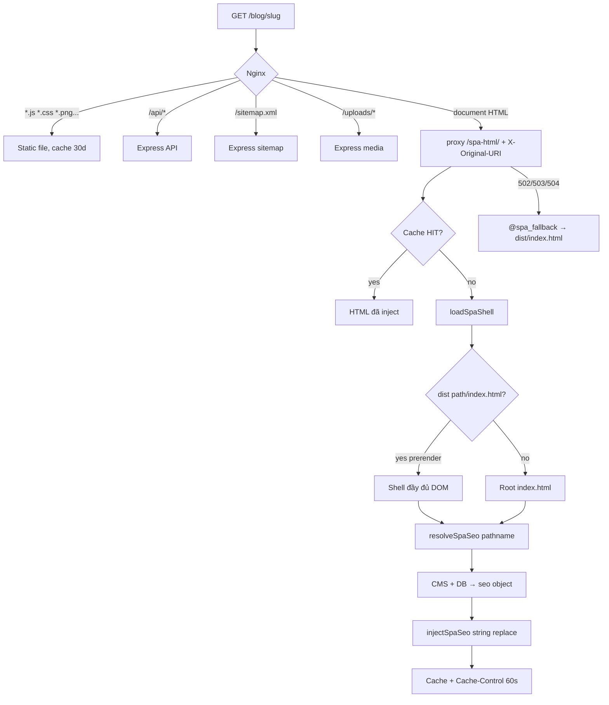

# Cấu trúc SEO Technical — Playbook port sang source khác

Tài liệu này mô tả **kiến trúc SEO kỹ thuật** của source hiện tại (React SPA + Express + Nginx), không phải nội dung copywriting. Mục tiêu: copy **pattern** sang project khác (đổi domain, route, CMS key, schema) mà không phải lần lại toàn bộ code.

Stack gốc: Vite + React Router, Express, PostgreSQL (CMS JSON + `blog_posts`), Nginx, Playwright prerender.

---

## 1. Vấn đề cần giải

SPA mặc định trả `index.html` giống nhau cho mọi URL. Crawler / social crawler (Google, Facebook, Zalo) **không chạy `useEffect`**. Do đó SEO phải có **HTML document đã chứa** title, description, canonical, Open Graph, Twitter Card, JSON-LD **trước khi JS hydrate**.

Giải pháp: **3 lớp HTML**, mỗi lớp là fallback của lớp trên.

```
Lớp 3  Live inject     Nginx document nav → Express /spa-html
                       Patch meta từ CMS/DB vào shell HTML
                       TTL cache ~60s, invalidate khi CMS/blog đổi

Lớp 2  Prerender       `npm run build` → Playwright snapshot public routes
                       Ghi dist/{path}/index.html (full DOM + h1)

Lớp 1  Static shell    index.html hardcoded + @spa_fallback khi backend 502
```

Crawler nhận Lớp 3. User JS vẫn chạy `usePageSeo` để meta đúng khi **client navigate** (không reload).

---

## 2. Request flow (production)



**Quy tắc Nginx bắt buộc:** `proxy_pass .../spa-html/;` phải có **trailing slash**. Không có slash thì `/dashboard` thành `/spa-htmldashboard` (404). Header `X-Original-URI` phải được forward để Express biết pathname thật.

---

## 3. Phân loại URL

Port sang source khác: giữ **3 bucket** này, chỉ đổi prefix/slug.

| Bucket | Ví dụ | Index | Sitemap | Schema | Ghi chú |
|---|---|---|---|---|---|
| Public marketing | `/`, `/gioi-thieu`, `/tools`, `/tools/:slug` | index | có | WebSite / Organization / WebApplication | CMS-driven |
| Public content | `/blog`, `/blog/:slug`, `/author` | index (404 bài → `noindex, follow`) | published only | CollectionPage / BlogPosting / ProfilePage | DB-driven |
| Private app | `/login`, `/register`, `/forgot-password`, `/reset-password`, `/dashboard`, `/admin` | `noindex, nofollow` | không | none | `robots.txt` Disallow trùng prefix |
| Catch-all | `*` → `Navigate to="/"` | **soft 404** | không | landing | Crawler thấy 200 homepage. Nên đổi thành 404 thật nếu port sang site content-heavy |

`robots.txt` và `NOINDEX_PREFIXES` **phải khớp nhau**. Không chỉ Disallow mà quên meta robots (và ngược lại).

---

## 4. Hợp đồng dữ liệu `seo` (copy nguyên)

Cả backend inject và frontend `usePageSeo` dùng **cùng shape**. Đây là điểm port quan trọng nhất — đừng để 2 bên lệch field.

```ts
type SchemaKind =
  | 'landing'         // WebSite + Organization + SoftwareApplication + FAQPage?
  | 'article'         // BlogPosting
  | 'collection'      // CollectionPage (list)
  | 'organization'    // Organization + FAQPage?
  | 'person'          // ProfilePage > Person
  | 'webApplication'  // WebApplication
  | 'none';           // xóa JSON-LD, trang private

interface SeoPayload {
  title: string;
  description: string;
  keywords?: string;
  siteName: string;
  pageUrl: string;            // absolute canonical
  ogImage?: string;           // absolute URL
  ogType?: 'website' | 'article';
  ogLocale?: string;          // vi_VN | en_US
  htmlLang?: 'vi' | 'en';
  robots?: string;            // 'noindex, nofollow' | 'noindex, follow'
  faviconUrl?: string;
  schemaKind: SchemaKind;
  faqs?: { q: string; a: string }[];
  articleAuthor?: string;
  articlePublishedTime?: string;  // ISO
  articleModifiedTime?: string;
  publisherLogo?: string;
  personName?: string;
  sameAs?: string[];          // social URLs
  lcpImage?: string;          // relative path, landing only
  noscript?: { h1: string; p: string };
}
```

**Thứ tự fallback title/description (mọi resolver):**

1. Field SEO chuyên biệt (`seo_title`, `seoTitle`)
2. Field nội dung (`title`, `summary`, `hero_subtitle`)
3. Default cứng (`SITE_NAME` / `DEFAULTS`)

**URL tuyệt đối:** relative → `{ORIGIN}{path}`. Origin backend = `FRONTEND_URL`, origin frontend/prerender = `VITE_SITE_URL`. Hai biến **phải cùng domain production**, không trailing slash.

---

## 5. Map route → resolver → schema

Port: thay pathname + CMS key + query, giữ `schemaKind`.

| Pathname | Resolver | Nguồn data | schemaKind | OG image |
|---|---|---|---|---|
| `/` | `resolveLandingSeo` | CMS `gym_cms_landing` | `landing` | `hero_image_url` → `seo_logo` |
| `/gioi-thieu` | `resolveAboutSeo` | CMS `gym_cms_about` + landing | `organization` | `hero_image` |
| `/blog` | `resolveBlogListSeo` | landing (site name) | `collection` | logo |
| `/blog/:slug` | `resolveBlogPostSeo` | `blog_posts` published | `article` | `cover_image` |
| `/author` | `resolveAuthorSeo` | CMS `gym_cms_author` | `person` | `avatar_url` |
| `/tools` | `resolveToolsIndexSeo` | landing | `collection` | logo |
| `/tools/:slug` | `resolveToolSeo` | CMS `gym_cms_tools[]` → preset `TOOL_SEO` | `webApplication` | logo |
| `/login`…`/admin` | `resolveNoIndexSeo` | defaults | `none` | — |
| khác | fallback landing | landing | `landing` | hero |

Bài blog không tồn tại: vẫn trả HTML 200 + `robots: noindex, follow` (tránh index trang rỗng). Port: cân nhắc HTTP 404 thật.

---

## 6. File map — copy sang source mới

Giữ **tên và trách nhiệm**; chỉ đổi nội dung domain/route.

### 6.1 Backend (runtime SEO — crawler thật sự đọc lớp này)

| File | Trách nhiệm | Port notes |
|---|---|---|
| `backend/utils/spa-seo-escape.js` | `escapeHtml` / `escapeAttr`, `getSiteOrigin`, `resolveAbsoluteUrl`, `canonicalUrl` | Copy gần như nguyên. Đổi default origin. |
| `backend/utils/spa-seo-defaults.js` | `DEFAULTS`, `NOINDEX_PREFIXES`, `TOOL_SEO`, `faqList` | Thay toàn bộ content + prefix. |
| `backend/utils/spa-seo-jsonld.js` | `buildJsonLd(seo)` theo `schemaKind` | Copy. Đổi `applicationCategory`, currency, offer text. |
| `backend/utils/spa-seo-resolve.js` | pathname → `SeoPayload` (CMS/DB) | Viết lại map route. Giữ normalize path (strip query/hash/trailing slash). |
| `backend/utils/spa-seo-cache.js` | in-memory TTL, `invalidateSpaSeoCache()` | Copy nguyên. |
| `backend/utils/spa-html-inject.js` | string-replace title/meta/OG/Twitter/canonical/favicon/JSON-LD/lang/noscript + LCP preload | Copy inject meta. LCP hero (`lpv2-*`) là landing-specific — tách nếu source khác không có hero img. |
| `backend/utils/spa-shell-loader.js` | load HTML: `SPA_DIST_DIR/{path}/index.html` → fetch frontend → repo `index.html` → fallback tối thiểu | Copy. 502 nếu chỉ còn fallback (để nginx serve static). |
| `backend/routes/spa-html.js` | `GET /spa-html` đọc `X-Original-URI` / `?path=` | Copy. Cache-Control `public, max-age=60, stale-while-revalidate=300`. |
| `backend/routes/sitemap.js` | `GET /sitemap.xml` | Viết lại `STATIC_PAGES` + nguồn slug động. |
| `backend/routes/cms.js` + `blog.js` | gọi `invalidateSpaSeoCache()` sau write | Mọi mutation ảnh hưởng public HTML phải invalidate. |
| `backend/server.js` | `app.use(sitemapRouter)` **không** prefix `/api`; `app.use('/spa-html', spaHtmlRouter)` | Giữ mount ngoài `/api` vì nginx proxy document nav riêng. |

### 6.2 Frontend (client navigate + prerender snapshot)

| File | Trách nhiệm | Port notes |
|---|---|---|
| `src/utils/pageSeo.ts` | `usePageSeo`, `useNoIndexSeo`, restore tag khi unmount | Copy. `VITE_SITE_URL` cho canonical khi prerender. |
| `src/utils/pageSeoJsonLd.ts` | mirror `spa-seo-jsonld.js` | **Phải đồng bộ** với backend khi đổi schema. |
| `index.html` | shell mặc định: lang, title, description, keywords, canonical, OG, Twitter, JSON-LD, `<noscript>` nội dung, early LCP/favicon script | Đổi copy. Giữ placeholder tags để inject **upsert** (replace) chứ không nhân đôi. |
| `src/pages/*` public | mỗi trang `useMemo` config + `usePageSeo` | 1 hook / 1 page. Auth pages dùng `useNoIndexSeo`. |
| `src/components/AppImage.tsx` | default `loading=lazy`; `priority` → eager + `fetchPriority=high` | Copy. Hero/logo/cover above-fold = `priority`. |
| `src/utils/google-tag-manager-inject.ts` | inject GTM từ CMS sau hydrate | Analytics, không phải ranking — giữ tách khỏi meta inject. |
| `scripts/prerender-public-pages.mjs` | Playwright snapshot public routes → `dist/{route}/index.html` | Đổi danh sách route + selector “page ready” (`h1`). |
| `public/robots.txt` | Allow `/`, Disallow private, `Sitemap:` | Đổi domain. |

### 6.3 Infra

| File | Trách nhiệm |
|---|---|
| `docker/nginx.conf` | static hashed assets 30d; `*.html` no-cache; `/api/` + `/uploads/` proxy; `/sitemap.xml` proxy; `/` → `/spa-html/` + `X-Original-URI`; 502 → `@spa_fallback` |
| `package.json` | `"build": "tsc -b && vite build && node scripts/prerender-public-pages.mjs"` |
| `.env` | `FRONTEND_URL`, `VITE_SITE_URL`, `SITE_NAME`, `SPA_SEO_CACHE_TTL_MS`, `SPA_SHELL_ORIGIN`, `SPA_DIST_DIR` |

---

## 7. Tags HTML được inject (checklist crawler)

`injectSpaSeo` upsert (replace nếu đã có, insert trước `</head>` nếu chưa):

| Tag | Nguồn |
|---|---|
| `<html lang>` | `htmlLang` default `vi` |
| `<title>` | `title` |
| `meta name=description` | `description` |
| `meta name=keywords` | optional |
| `meta name=robots` | private / missing post |
| `meta name=author` | article |
| `og:type` `og:title` `og:description` `og:url` `og:site_name` `og:image` `og:locale` | payload |
| `article:published_time` `article:modified_time` | article |
| `twitter:card` (`summary_large_image` nếu có ảnh) `twitter:title` `twitter:description` `twitter:image` | payload |
| `link rel=canonical` | `pageUrl` |
| `link rel=icon` | favicon CMS |
| `script type=application/ld+json` + `data-page-seo-ld` | `buildJsonLd`; xóa hết LD cũ rồi insert 1 block |
| `link rel=preload as=image fetchpriority=high` | landing LCP |
| `script#lpv2-lcp-boot type=application/json` | `{ hero_image_url }` để React paint trước CMS fetch |
| `<noscript><main><h1>…` | landing, crawler không JS |
| `data-spa-seo-injected="1"` trên `<html>` | debug: biết request đã qua inject |

Mọi giá trị đi qua `escapeHtml` / `escapeAttr`. JSON-LD dùng `JSON.stringify` (an toàn hơn nối string).

---

## 8. JSON-LD theo `schemaKind`

Graph `@context: https://schema.org` + `@graph[]`. Không nhét nhiều type không liên quan vào 1 node.

| kind | Nodes | Dùng khi |
|---|---|---|
| `landing` | WebSite, Organization, SoftwareApplication, FAQPage? | Homepage sản phẩm |
| `organization` | Organization, FAQPage? | About / công ty |
| `article` | BlogPosting (+ author Person, publisher Organization + logo ImageObject) | Bài viết |
| `collection` | CollectionPage `isPartOf` WebSite | List blog / list tools |
| `person` | ProfilePage → Person + `sameAs` | Author / founder |
| `webApplication` | WebApplication + Offer price 0 | Tool miễn phí |
| `none` | `@graph: []` rồi **xóa script** | Private |

FAQ chỉ emit khi `faqs[]` có `q` + `a`. Câu hỏi trên trang phải **trùng text** với JSON-LD (Google FAQ rich result).

Port: đổi `SoftwareApplication` / `HealthApplication` / `priceCurrency` cho ngành mới. Giữ FAQ chỉ trên trang thực sự có accordion FAQ.

---

## 9. CMS / DB fields cần có

Không hardcode title/description trong code production — code chỉ là fallback.

### 9.1 CMS JSON (`cms_content.key`)

| Key | Field SEO |
|---|---|
| `gym_cms_landing` | `seo_site_name`, `seo_title`, `seo_description`, `seo_logo`, `hero_image_url`, `faqs[]`, (optional EN: `seo_title_en`…) |
| `gym_cms_about` | `seo_title`, `seo_description`, `hero_image`, `faqs[]` |
| `gym_cms_author` | `name`, `bio`, `avatar_url`, `social_*` |
| `gym_cms_tools` | array `{ slug, enabled, seoTitle, seoDescription }` |
| `gym_config_favicon` | URL / data-URI |
| GTM config | `headScript`, `bodyScript`, `enabled` — inject client-side, không nằm trong `/spa-html` |

Admin UX: đếm ký tự title ≤ 60, description ≤ 160 (cảnh báo, không block).

### 9.2 Bảng `blog_posts`

```
seo_title VARCHAR(255)
seo_description TEXT
seo_keywords TEXT
slug UNIQUE
status IN ('draft','published')
cover_image, author, created_at, updated_at
```

Sitemap và resolver **chỉ `status = 'published'`**. Lookup slug **hoặc** id **hoặc** `legacy_id` (canonical path vẫn là `/blog/{slug}`).

### 9.3 Bảng `media_library`

`alt_text` bắt buộc khi upload. Blog markdown chèn `alt` từ media. Đây là SEO hình ảnh, không phải meta.

---

## 10. On-page / Core Web Vitals (đi kèm technical SEO)

Không đủ meta nếu DOM public page không crawlable.

| Quy tắc | Cách source này làm | Port |
|---|---|---|
| 1 `h1` / trang | Landing hero, blog title, tool heading | Kiểm tra prerender wait selector `h1` |
| `<main id="main-content">` | Public pages | Giữ landmark |
| Header/footer dùng `<nav>` + `<Link>` thật | `PublicSiteHeader` / `PublicSiteFooter` | Không render nav bằng `div` + `onClick` only |
| Ảnh LCP | `AppImage priority` + server `rel=preload` + boot JSON | Chỉ 1 LCP image / homepage |
| Ảnh below-fold | `loading="lazy"` `decoding="async"` | Default `AppImage` |
| Font | `preconnect` + stylesheet `media=print` onload `all` | Tránh block LCP |
| Favicon CMS | `requestIdleCallback` — không tranh LCP | Defer third-party không ranking |
| Catch-all SPA | `*` → homepage | Đổi 404 nếu cần |
| Prerender | Đợi `#root > *` + `h1` + `html[data-favicon-ready]` | Selector phải match DOM thật |
| URL prerender | Replace `localhost:4173` → `VITE_SITE_URL` | Canonical không bị localhost |

---

## 11. Cache

| Lớp | TTL | Invalidate |
|---|---|---|
| Express `spa-seo-cache` | `SPA_SEO_CACHE_TTL_MS` (prod 60s, dev 5s) | `invalidateSpaSeoCache()` khi CMS PUT/DELETE hoặc blog publish/update/delete |
| HTTP `Cache-Control` | `public, max-age=60, stale-while-revalidate=300` | browser/CDN |
| Nginx `*.html` | `no-cache` | shell luôn lấy bản mới khi backend down fallback |
| Hashed assets | 30d immutable | đổi hash khi build |
| Sitemap | `max-age=3600` | chấp nhận trễ 1h |

Debug: response header `X-SPA-SEO-Cache: HIT|MISS`, `X-SPA-Shell-Source: dist|frontend|dev-source`, `X-SPA-SEO-Fallback: 1` khi nginx fallback.

---

## 12. Biến môi trường

| Biến | Side | Việc |
|---|---|---|
| `FRONTEND_URL` | backend | canonical, og:url, sitemap `<loc>`, absolute image |
| `VITE_SITE_URL` | frontend build / prerender | cùng domain với `FRONTEND_URL` |
| `SITE_NAME` | backend defaults | fallback title/siteName |
| `SPA_SHELL_ORIGIN` | backend | fetch shell từ container frontend |
| `SPA_SHELL_HOST` | backend (dev) | Host header khi origin là hostname Docker |
| `SPA_DIST_DIR` | backend | đọc prerender files local |
| `SPA_SEO_CACHE_TTL_MS` | backend | TTL inject |
| `SKIP_PRERENDER=1` | build | bỏ Playwright |
| `PRERENDER_STRICT=1` | build | fail CI nếu 1 route lỗi |
| `PRERENDER_API_URL` | build | lấy slug blog published |

Sai `FRONTEND_URL` (localhost trên production) = toàn bộ canonical/og:image/sitemap hỏng.

---

## 13. Thứ tự port sang source khác

Làm theo thứ tự này — đừng bắt đầu từ JSON-LD.

1. **Chốt origin** — `FRONTEND_URL` = `VITE_SITE_URL` = domain thật, HTTPS, no trailing slash.
2. **Chốt bucket URL** — public indexable / private noindex / dynamic content. Viết bảng như mục 3.
3. **Copy escape + cache + shell-loader + spa-html route + nginx location `/` và `/sitemap.xml`.** Chạy curl `GET /` phải thấy `data-spa-seo-injected` và title đúng path.
4. **Copy `pageSeo.ts` + `pageSeoJsonLd.ts`.** Gắn `usePageSeo` / `useNoIndexSeo` từng route public/auth.
5. **Viết `spa-seo-defaults.js` + `spa-seo-resolve.js`** theo bảng route mới (CMS key, query SQL).
6. **Đồng bộ `buildJsonLd` backend ↔ frontend.** Đổi category/offer/FAQ.
7. **`index.html`** placeholder meta + noscript + lang. Không để trống `</head>` thiếu title/description (fallback khi 502).
8. **Sitemap + robots.txt** — static pages + slug động published; Disallow = `NOINDEX_PREFIXES`.
9. **CMS/DB fields** title/description/og image/alt. Invalidate cache trên mọi write.
10. **Prerender** danh sách route + wait `h1`. Build phải chạy được khi API tắt (bỏ blog routes, vẫn snapshot static).
11. **LCP (optional)** preload + 1 hero `` eager. Chỉ làm sau khi meta đã đúng.
12. **Verify** (mục 14) trước khi bật GTM.

Không copy nguyên LCP inject (`lpv2-hero-*`, `replaceBalancedDiv`) nếu DOM landing khác — phần đó gắn class CSS cụ thể.

---

## 14. Verify sau khi port

```bash
# Document HTML — không phải JSON API
curl -sI https://DOMAIN/
curl -s https://DOMAIN/ | grep -E 'data-spa-seo-injected|<title>|canonical|og:url|ld\+json|robots'

curl -s https://DOMAIN/blog/SLUG | grep -E '<title>|og:type|article:published|BlogPosting'
curl -s https://DOMAIN/login | grep -E 'noindex'

curl -s https://DOMAIN/sitemap.xml
curl -s https://DOMAIN/robots.txt

# View-source (không DevTools Elements) — meta phải có trước JS
```

Checklist tay:

- [ ] Mỗi public URL: title / description / canonical **khớp path** (không dính homepage).
- [ ] `og:url` = canonical = sitemap `<loc>` = `FRONTEND_URL` + path, không trailing slash trừ `/`.
- [ ] `og:image` absolute HTTPS, không path tương đối.
- [ ] Private: meta robots + robots.txt Disallow.
- [ ] JSON-LD parse được, URL trong graph tuyệt đối.
- [ ] Blog draft không có trong sitemap.
- [ ] Sửa CMS → đợi TTL hoặc invalidate → view-source đổi.
- [ ] Backend tắt → trang vẫn mở (`X-SPA-SEO-Fallback`), meta là hardcoded `index.html`.
- [ ] Client click nội bộ: title đổi, unmount restore (không leak noindex sang homepage).

Tool: Google Rich Results Test, URL Inspection, Facebook Sharing Debugger, `https://validator.schema.org`.

---

## 15. Việc source này cố ý chưa làm

Mang theo hoặc bỏ khi port:

| Gap | Hiện trạng | Gợi ý |
|---|---|---|
| HTTP status 404 | Catch-all → homepage 200 | Route 404 + `noindex` nếu site nhiều URL ảo |
| `hreflang` | Có copy EN trong CMS, HTML `lang` đổi client-side | Nếu URL EN riêng (`/en/...`) mới thêm `link rel=alternate` |
| `og:image:width/height` | không | Thêm nếu social crop sai |
| BreadcrumbList JSON-LD | không | Nên có trên `/blog/:slug`, `/tools/:slug` |
| Pagination / `rel=next` | blog list 1 trang | Thêm khi list phân trang |
| `lastmod` sitemap tools/static | chỉ blog có | CMS `updated_at` nếu có |
| Skip-to-content link | có `#main-content`, chưa có skip link | A11y + crawler landmark |
| Canonical query string | strip query | Đúng; đừng index `?utm=` |
| GTM trong HTML crawler | inject sau hydrate | OK cho ranking; nếu cần Consent Mode server-side thì tách |

---

## 16. Nguyên tắc khi port (rút gọn)

1. **Crawler đọc HTML response**, không đọc React state. Mọi thứ ranking-critical phải có trong `/spa-html` inject.
2. **Một `seo` object, hai consumer** (Express inject + `usePageSeo`). Đổi schema thì sửa cả hai file JSON-LD.
3. **Origin env sai = SEO hỏng im lặng** (canonical localhost).
4. **noindex prefix = robots.txt = không sitemap.**
5. **CMS write → invalidate cache.** TTL không thay cho invalidate.
6. **Prerender là tăng chất lượng shell** (h1, nội dung), không thay live inject (CMS đổi sau build).
7. **Nginx trailing slash `/spa-html/`** là bug đã gặp — giữ khi copy config.

Nguồn sự thật trong repo này: `backend/utils/spa-seo-*.js`, `backend/routes/spa-html.js`, `backend/routes/sitemap.js`, `docker/nginx.conf`, `src/utils/pageSeo.ts`, `scripts/prerender-public-pages.mjs`, `index.html`, `public/robots.txt`.
